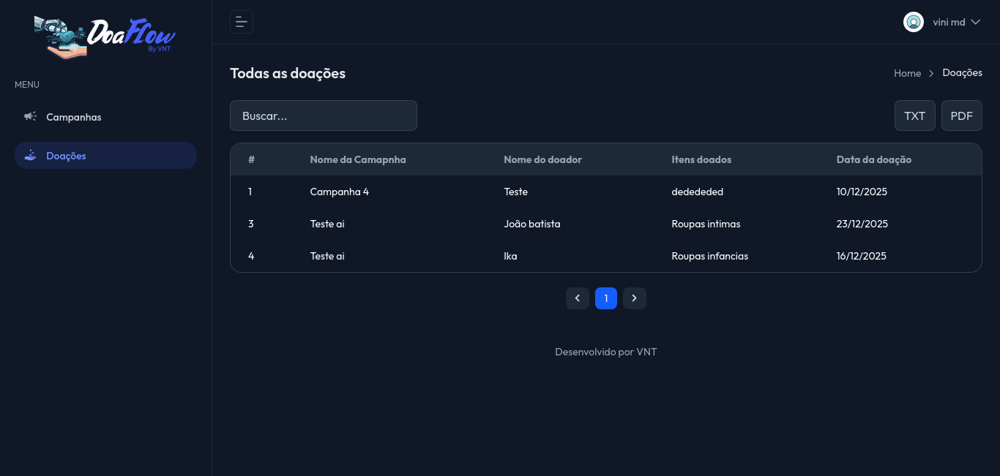

# 📦 DoaFlow

Sistema de gerenciamento de doações desenvolvido em Laravel.

## Origem

Criado para ajudar em um caso real de acidente, o **DoaFlow** surgiu da necessidade de organizar doações locais de forma simples e eficiente.

Mais do que um sistema isolado, ele é um sistema de doação multi-campanhas.

## Desenvolvimento

O sistema foi desenvolvido com **Laravel** no Backend, utilizando autenticação via **Sanctum**, e **Vue.js** no Frontend, adotando uma arquitetura de API desacoplada.

Essa combinação se mostrou adequada para o escopo proposto, com fluxo controlado e foco em usabilidade.

## O que ele resolve?

O **DoaFlow** atende cenários de doações locais que envolvem **entrega física**, sem transações financeiras digitais.

Ele oferece controle e organização para pessoas ou grupos que desejam ajudar alguém em situação de vulnerabilidade, permitindo gerenciar campanhas e acompanhar doadores de forma clara.

## Capturas

## ⚙️ Funcionalidades

- Criação de campanhas
- Links públicos para doadores
- Painel administrativo

## 🛠️ Stack

- Laravel
- MySQL
- Sanctum
- Docker (Sail)
